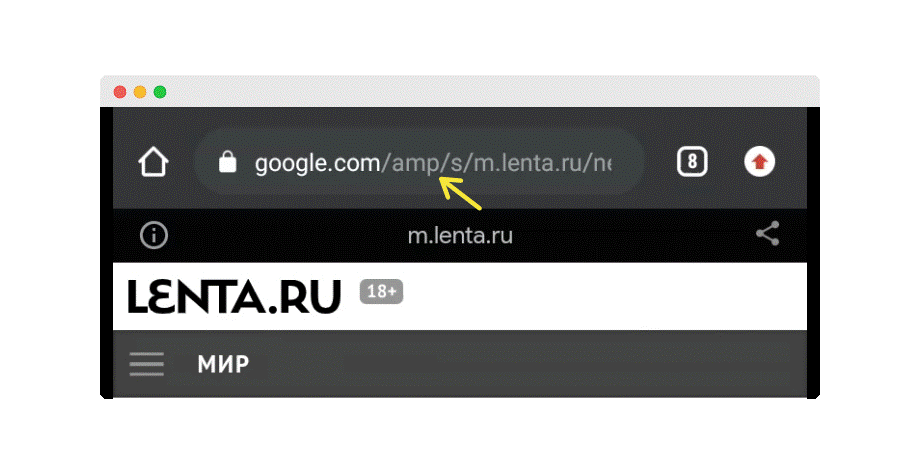

Технология AMP получила свою известность, как решение, позволяющее делать сайты максимально быстрыми. 

<!--more-->

                                                      
Поисковые системы вознаграждают быстрые сайты. Чем быстрее сайт, тем выше его технический рейтинг и соответственно позиция в поисковой выдаче. Картинки, панели расширенного поиска, все то, что попадает в топ поисковой выдачи попадает туда, как правило, за счет технологии AMP. 

Чтобы в этом убедиться достаточно ввести популярный поисковый запрос в браузере мобильного устройства. При переходе на большинство сайтов из топа поисковой выдачи, в их URL-адресах можно легко заметить аббревиатуру AMP. 

Это означает, что перед вами страница сайта, которая вышла в топ поисковой выдачи за счет технологии AMP. 

## Как работает AMP? 

В настоящий момент существует три направления работы с AMP: 

### 1) Автоматическое преобразование

Чтобы улучшить показатели SEO многие конструкторы сайтов предлагают своим клиентам автоматическое преобразование. Минус такого способа состоит в том, что внешний вид страниц часто непредсказуемо меняется. Такого не происходит если страница сделана полностью из компонентов AMP. 

### 2) Работа с компонентами

Отказавшись от JavaScript, команда AMP предложила свою библиотеку компонентов. Начиная от небольших и заканчивая сложными, например, веб-историями, AMP компоненты – это кирпичики с помощью которых создаются  AMP  страницы. При этом страница может быть сделана как целиком из компонентов, так и частично. Например, магазин Ebay, не переходя полностью на AMP, использует всего один AMP компонент, а именно - карусель с горизонтальной прокруткой. 



### 3) Дублирование контента в AMP

CMS далеко не всех сайтов позволяют делать автоматическое преобразование, кроме того не все хотят решать возможные проблемы в дизайне, поэтому третий и самый популярный способ работы с AMP – это дублирование контента.  Страницы, с особо ценным  контентом,  дублируются в AMP. Эту технику можно отнести к лучшим практикам, так как поисковый траффик приходится на лучшее, что может предложить сайт. 

